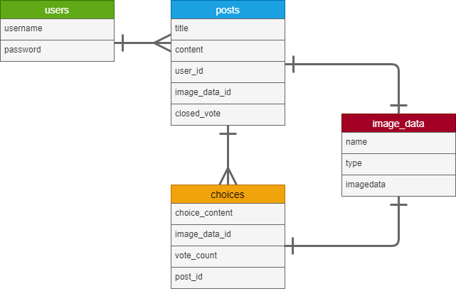

### アプリケーション名
___ 
Better

### アプリケーション概要
___
悩んでいる選択を投稿し、他のユーザーから投票してもらうことで、選択の参考にすることができるSNS。
また、他のユーザーは自分の悩みと近しい投稿を閲覧することで、問題解決の参考にすることができ、他のユーザーの考えや、現在のトレンド等を知ることが出来る。

### URL
___
https://better-ux9a.onrender.com

### テスト用アカウント
___
* ユーザー名：テスト
* パスワード：123456789aaa

### 利用方法
___

#### 選択を投稿
___
1. トップページのヘッダーからユーザー新規登録を行う
2. 投稿するボタンから、選択の内容（タイトル・説明・チョイス）を入力して投稿する

#### 投票をする
___
1. 一覧ページ（トップページ）から投稿のタイトルをクリックし、投稿の詳細を確認する
2. 選択したチョイスの投票するボタンから投票をする

### アプリケーションを作成した背景
___
選択に迷った際に、手軽に皆の意見がもらえるようなアプリがあれば、役に立つかと思い作成しました。
作成に際しては、簡単に投稿、投票ができ、簡単に結論だけを確認できるような仕様を意識して作成しております。

### 実装した機能
___
* ユーザーの新規登録
* ログイン・ログアウト機能
* テキストの投稿
* 画像の投稿
* 投稿の編集・削除
* 投票機能
* 投票数集計・表示機能

### 実装予定の機能
___
* チョイスの画像アップロード、表示機能
* 投票の停止
* カテゴリー分別機能
* ユーザーにおいていのメールアドレス等、入力項目の充実
* バリデーションの追加
* ユーザー詳細ページ
* ログイン時のSNS認証
* SNS共有機能
* 1ユーザーにつき、同投稿への投票回数を一回に制限
* 画像の編集機能改修（画像の削除、更新前の画像データの削除）

### データベース設計
___

### 画面遷移図
___

### 開発環境
___
* Java
* Spring Boot
* MySQL
* Github
* Render
* IntelliJ IDEA

